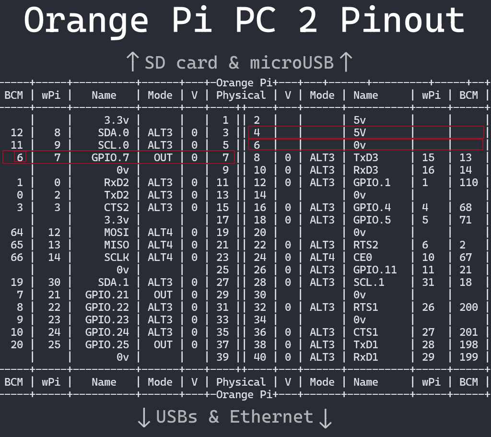
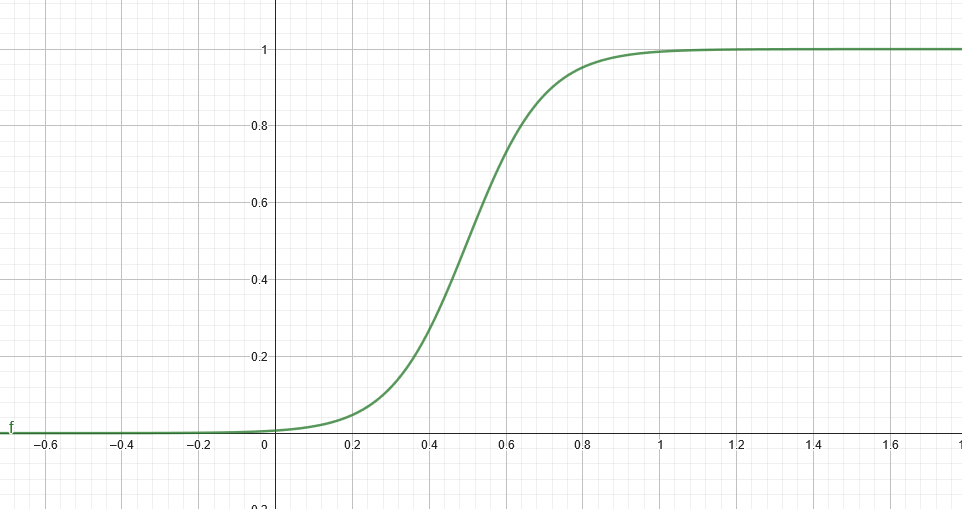

# Orange Pi Software PWM fan control

A simple python script to control a PWM fan for cooling.

Run it with `sudo python3 ./fan.py`

It is configured to run with Orange Pi PC 2, but can be easily adapted for any other board.

Default values:
```
Lowest temperature on the curve: 20°C
Highest temperature on the curve: 75°C
Averaging across 10 values over 5 seconds, checking every 500ms
Duty Cycle cutoff: 23%
Full Cycle: 25ms
Selected pin: 6 (see below)
```

## Reference Pinout

**Please note, that the script uses BCM numbering scheme!**


## Default Curve
